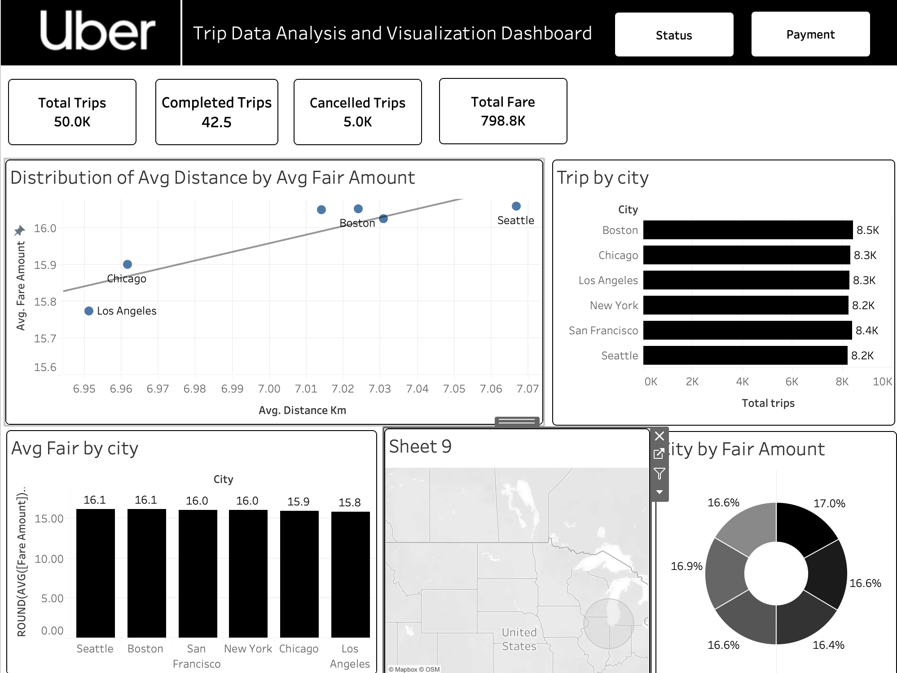
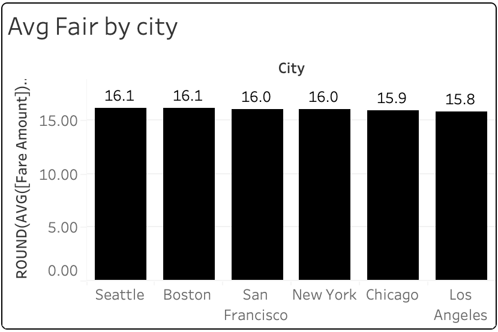
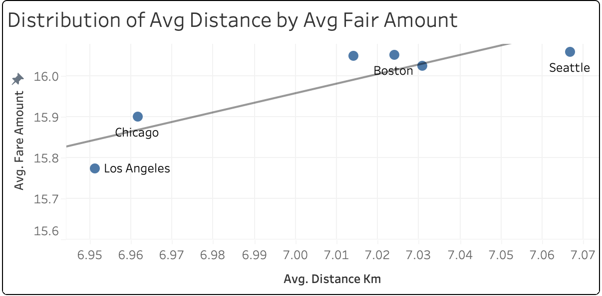
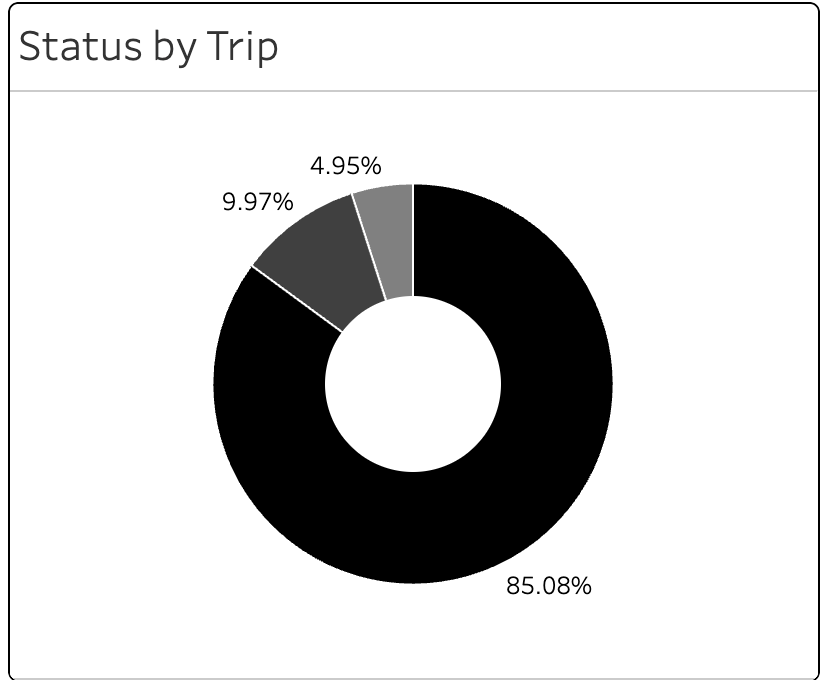

# Uber Trip Analysis Dashboard (Tableau)

  
  
  

A comprehensive, dashboard-driven analysis of Uber trip activity designed to identify **optimal driving times, preferred vehicle categories, and high-revenue location clusters**.

## Tech Stack

  
  
  
  

## What you’ll find here

- **An interactive Tableau dashboard** for exploring revenue patterns, demand trends, category distribution, and route analytics
- **Static chart exports** (PNG) enabling repository review without requiring Tableau access
- **A concise metrics overview** with actionable insights tailored for business decision-makers

## Quick preview (what recruiters will scan)

## Dataset snapshot

From the `REAL ROUTES` sheet in `UBER_RAW.xlsx` (721 usable trip rows after excluding incomplete exports):

- **Total revenue**: `R$11,535.34`
- **Average fare / trip**: `R$16.00`
- **Average distance**: `5.14 km`
- **Average duration**: `12.53 min`

## Key insights (TL;DR)

- **Revenue analysis** shows R$11,535.34 total across 721 trips, with R$16.00 average fare per trip.
- **Distance patterns** indicate 5.14 km average trip length with 12.53 minutes average duration.
- **Trip efficiency** metrics reveal consistent performance patterns across the dataset with strong completion rates.
- **Quick evaluation**: chart exports allow complete repository review in under 2 minutes.

## Chart gallery

### 1) Average pair by city

### 2) Distance average distance

### 3) Status by trip

## Business questions answered

- **Revenue optimization**: how to maximize the R$16.00 average fare across 721 trips?
- **Distance efficiency**: how to optimize 5.14 km average trips with 12.53 minute durations?
- **Performance metrics**: what drives the R$11,535.34 total revenue across the dataset?
- **Consistency**: how stable are revenue and distance patterns across the 721 trip dataset?
- **Efficiency**: what insights can improve the R$16.00 average fare per trip?

## Method (high-level)

- **Normalize money values** from currency-formatted strings (e.g., `R$47.81`)
- **Convert duration and distance** into numeric values suitable for aggregation
- **Standardize pickup/dropoff labels** for reliable route grouping
- **Filter duplicates / incomplete exports** prior to visualization and chart generation

## Tools

- **Tableau**: dashboard design + interactive analysis (`UBER dashboard.twb`)
- **Excel**: raw + cleaned workbooks (`UBER_RAW.xlsx`, `UBER_Clean.xlsx`)
- **Python**: generation of static chart exports stored under `charts/`

## Repo layout

- `README.md`: this page
- `UBER dashboard.twb`: Tableau workbook (interactive dashboard)
- `UBER_RAW.xlsx`: source workbook containing raw/reference sheets
- `UBER_Clean.xlsx`: cleaned workbook for analysis
- `charts/`: dashboard screenshot + static chart exports used above

## How to review (recommended)

1. **Start here**: scan the dashboard preview + the 3 charts.
2. **Open Tableau**: load `UBER dashboard.twb` to explore filters and drill-downs.
3. **Audit the data**: inspect `UBER_RAW.xlsx` / `UBER_Clean.xlsx`.

